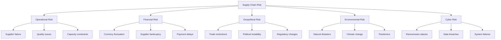

# Chapter 1: Supply Chain Risk Foundations

## Introduction

Supply chain risk management has emerged as a critical discipline for organizations operating in an interconnected global economy. The fragility of modern supply chains became starkly apparent during recent disruptions, forcing executives to reconsider long-held assumptions about efficiency, cost optimization, and just-in-time inventory strategies. This chapter establishes foundational concepts for understanding and categorizing supply chain risks.

## What is Supply Chain Risk?

Supply chain risk encompasses any potential disruption to the flow of materials, information, or finances across the network of organizations involved in producing and delivering goods or services to end customers. Unlike traditional enterprise risks confined to single organizations, supply chain risks cascade across multiple tiers of suppliers, logistics providers, and distribution channels.

!!! info "Definition"
    **Supply chain risk** is the likelihood and impact of unexpected events or conditions that negatively affect any part of the supply chain, from raw material sourcing through final product delivery.

Risk manifests in several dimensions:

- **Probability**: How likely is the disruption to occur?
- **Impact**: What are the financial, operational, and reputational consequences?
- **Velocity**: How quickly does the risk materialize?
- **Recovery**: How long does it take to restore normal operations?

## Categories of Supply Chain Risk

Supply chain risks fall into five major categories, each requiring distinct mitigation strategies.

### Operational Risk

Operational risks arise from day-to-day supply chain activities. These include supplier production failures, quality defects, capacity constraints, transportation delays, and labor disputes. A single supplier experiencing equipment failure can halt production for multiple downstream customers.

### Financial Risk

Financial risks involve monetary exposure across the supply chain. Currency exchange rate fluctuations can dramatically alter procurement costs. Supplier insolvency leaves buyers scrambling for alternative sources. Extended payment terms create cash flow pressures. Credit availability affects suppliers' ability to purchase raw materials.

### Geopolitical Risk

Geopolitical risks stem from government actions and international relations. Trade wars impose tariffs that reshape sourcing economics. Sanctions restrict access to specific suppliers or markets. Regulatory changes require costly compliance adjustments. Political instability in sourcing regions creates unpredictability.

### Environmental Risk

Environmental risks encompass natural and human-caused events affecting physical assets and operations. Earthquakes, floods, hurricanes, and wildfires disrupt facilities and transportation routes. Climate change introduces long-term shifts in resource availability and extreme weather frequency. Pandemics, as COVID-19 demonstrated, can simultaneously affect demand, supply, and logistics globally.

### Cyber Risk

Cyber risks target the digital infrastructure enabling modern supply chains. Ransomware attacks lock critical systems. Data breaches expose sensitive supplier and customer information. Software vulnerabilities create backdoors for malicious actors. Third-party IT service providers represent concentrated points of failure.

## Risk Management Frameworks

Multiple frameworks guide supply chain risk management:

!!! note "Key Frameworks"
    - **ISO 28000**: Security management for supply chains
    - **ISO 31000**: General risk management principles
    - **COSO ERM**: Enterprise risk management integration
    - **NIST Cybersecurity Framework**: Digital risk management
    - **SCOR Model**: Supply chain operations reference

Each framework provides structures for identifying, assessing, mitigating, and monitoring risks. ISO 28000, the focus of this course, specifically addresses security and resilience in supply chain contexts.

## ISO 28000 Overview

ISO 28000:2007 (revised 2022) specifies requirements for a security management system for organizations in the supply chain. It applies to all sizes of organizations involved in manufacturing, service, storage, or transportation at any stage of production or supply.

The standard adopts a Plan-Do-Check-Act (PDCA) methodology:

| Phase | Activities |
|-------|------------|
| **Plan** | Establish security policy, identify risks, set objectives |
| **Do** | Implement security controls and procedures |
| **Check** | Monitor performance, conduct audits, review effectiveness |
| **Act** | Take corrective action, drive continuous improvement |

ISO 28000 integrates with quality management (ISO 9001) and risk management (ISO 31000) standards, enabling unified management systems.

## Historical Supply Chain Disruptions

Examining past disruptions reveals patterns and lessons for future resilience.

### COVID-19 Pandemic (2020-2022)

The pandemic simultaneously shocked demand, supply, and logistics. Factory closures in China halted production globally. Consumer behavior shifted from services to goods, overwhelming logistics networks. Semiconductor shortages cascaded through electronics and automotive industries. Organizations with diversified supplier bases and inventory buffers fared better than those optimized purely for cost.

### Suez Canal Blockage (2021)

The container ship Ever Given ran aground in the Suez Canal, blocking one of the world's critical maritime chokepoints for six days. Approximately $9-10 billion in trade was held up daily. The incident highlighted geographic concentration risk and the ripple effects of single-point failures in global logistics.

### Semiconductor Shortage (2020-2023)

A perfect storm of increased demand (work-from-home technology, automotive recovery), supply constraints (fab capacity, raw material limits), and geopolitical factors (trade restrictions) created a multi-year semiconductor shortage. Automotive manufacturers cut production, consumer electronics faced delays, and organizations learned painful lessons about tier-2 and tier-3 supplier visibility.

### Fukushima Earthquake and Tsunami (2011)

The disaster in Japan disrupted automotive and electronics supply chains globally. Companies dependent on single-source Japanese suppliers experienced months-long production halts. The event accelerated interest in supplier diversification and business continuity planning.

### Thailand Floods (2011)

Massive flooding in Thailand disrupted hard disk drive production, affecting 25% of global supply. Computer manufacturers faced critical shortages. The concentration of hard drive production in a single geographic region created systemic vulnerability.

## Key Lessons from Disruptions

Analysis of major disruptions reveals consistent themes:

1. **Visibility Matters**: Organizations lacking visibility beyond tier-1 suppliers struggled to identify vulnerabilities
2. **Efficiency vs Resilience Trade-off**: Lean, just-in-time systems optimized for cost proved fragile under stress
3. **Geographic Concentration**: Over-reliance on single regions or routes creates systemic risk
4. **Cascading Effects**: Disruptions rarely stay contained; they propagate through interconnected networks
5. **Recovery Asymmetry**: Restoration takes longer than disruption; some changes become permanent

## Conclusion

Supply chain risk management requires systematic approaches to identifying, categorizing, and mitigating diverse threats. The ISO 28000 framework provides structured methodology for building security and resilience into supply chain operations. Understanding historical disruptions helps organizations prepare for future challenges by learning from past failures.

The next chapter explores specific methods and tools for identifying risks before they materialize into disruptions.

## Self-Assessment Questions

1. What distinguishes supply chain risk from traditional enterprise risk?
2. Describe three examples each of operational, financial, and geopolitical risks
3. How did the COVID-19 pandemic differ from previous supply chain disruptions?
4. What is the relationship between ISO 28000 and ISO 31000?
5. Why did the Suez Canal blockage have such significant global impact?
