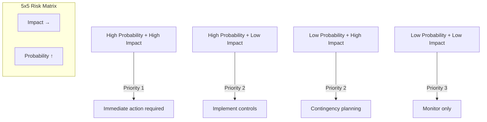
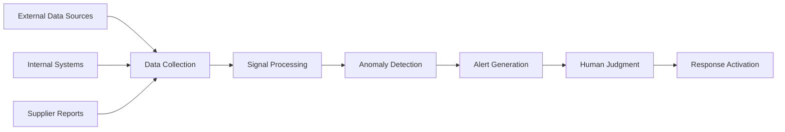

# Chapter 2: Risk Identification

## Introduction

Risk identification forms the foundation of effective supply chain risk management. Organizations cannot mitigate risks they do not know exist. This chapter explores systematic methods for discovering vulnerabilities across supply chain networks, from tier-1 suppliers through logistics providers to end customers.

## The Challenge of Risk Identification

Modern supply chains involve hundreds or thousands of entities across multiple continents. A smartphone manufacturer might have 200 tier-1 suppliers, 2,000 tier-2 suppliers, and tens of thousands of tier-3 suppliers. Each node represents potential risk exposure. Traditional approaches focusing only on direct suppliers miss the majority of vulnerabilities.

!!! warning "Hidden Risks"
    Research shows that 80% of supply chain disruptions originate beyond tier-1 suppliers, yet most organizations have limited visibility into these deeper tiers.

Effective risk identification requires:

- **Systematic methodologies** rather than ad-hoc assessments
- **Cross-functional participation** from procurement, operations, finance, and IT
- **Continuous monitoring** as risks evolve dynamically
- **Data-driven analysis** supplementing expert judgment

## Risk Registers

A risk register documents identified risks in structured format, enabling tracking and prioritization. Each entry typically includes:

| Field | Description | Example |
|-------|-------------|---------|
| **Risk ID** | Unique identifier | SR-001 |
| **Category** | Type of risk | Operational |
| **Description** | Specific risk scenario | Supplier ABC single-source for component X |
| **Probability** | Likelihood of occurrence | Medium (30-50%) |
| **Impact** | Severity of consequences | High ($5M+ revenue impact) |
| **Velocity** | Speed of onset | Slow (weeks) |
| **Current Controls** | Existing mitigations | Quarterly supplier audits |
| **Risk Owner** | Responsible party | Procurement Manager |
| **Status** | Active, mitigated, accepted | Active |

Risk registers should be living documents, updated as new information emerges and conditions change.

!!! tip "Best Practice"
    Integrate risk registers with project management and supplier management systems to ensure visibility and accountability.

## Risk Matrices

Risk matrices provide visual representation of risks based on probability and impact. They enable quick prioritization and resource allocation.

### Constructing Risk Matrices

1. **Define probability scales**: Use consistent criteria (e.g., rare <5%, unlikely 5-25%, possible 25-50%, likely 50-75%, almost certain >75%)
2. **Define impact scales**: Quantify consequences (financial, operational, reputational)
3. **Plot identified risks**: Position each risk based on assessment
4. **Establish thresholds**: Define which zones require active mitigation vs monitoring
5. **Update regularly**: Reassess as conditions change

!!! note "Limitations"
    Risk matrices simplify complex scenarios. They should complement, not replace, detailed risk analysis.

## Failure Mode and Effects Analysis (FMEA)

FMEA systematically examines potential failure points and their consequences. Originally developed for engineering, FMEA adapts well to supply chain contexts.

### FMEA Process

**Step 1: Identify potential failure modes**
What could go wrong? Examples:
- Supplier production line failure
- Transportation delay due to weather
- Quality defect in raw materials
- Customs clearance issues

**Step 2: Determine effects of each failure**
What happens if the failure occurs?
- Production stoppage
- Customer delivery delays
- Product recalls
- Regulatory penalties

**Step 3: Assess severity, occurrence, and detection**

| Rating | Severity | Occurrence | Detection |
|--------|----------|------------|-----------|
| 1-3 | Minor impact | Rare | Easily detected |
| 4-6 | Moderate impact | Occasional | Moderate detection |
| 7-9 | Severe impact | Frequent | Difficult to detect |
| 10 | Catastrophic | Certain | Cannot detect |

**Step 4: Calculate Risk Priority Number (RPN)**

RPN = Severity × Occurrence × Detection

Higher RPNs indicate greater priority for mitigation.

**Step 5: Implement corrective actions**

Focus on reducing severity, occurrence, or improving detection capabilities.

### FMEA Example: Supplier Risk

| Failure Mode | Effect | Severity | Occurrence | Detection | RPN | Action |
|--------------|--------|----------|------------|-----------|-----|--------|
| Single supplier capacity constraint | Production stoppage | 9 | 6 | 7 | 378 | Qualify second supplier |
| Supplier quality issue | Customer returns | 7 | 4 | 5 | 140 | Enhance incoming inspection |
| Supplier financial distress | Supply interruption | 8 | 3 | 8 | 192 | Implement financial monitoring |

## Scenario Analysis

Scenario analysis explores "what if" situations to test supply chain resilience. Unlike FMEA's component-level focus, scenario analysis examines system-wide effects of major disruptions.

### Developing Scenarios

1. **Identify plausible scenarios**: Based on historical events, emerging trends, or extreme but possible situations
2. **Define scenario parameters**: Geographic scope, duration, severity
3. **Map impacts**: Trace effects through supply chain network
4. **Identify response options**: Evaluate potential mitigation strategies
5. **Quantify consequences**: Estimate financial and operational impacts

### Example Scenarios

**Scenario 1: Regional Natural Disaster**
- 7.5 magnitude earthquake in Taiwan disrupts semiconductor fabs
- 60% of chip production offline for 4-6 weeks
- Global electronics and automotive production affected
- Financial impact: $500M revenue loss, 20% market share erosion

**Scenario 2: Geopolitical Conflict**
- Trade embargo on critical mineral exports from specific region
- 90-day lead time extension for alternative sources
- Price increase of 40% for substitute materials
- Financial impact: $200M increased costs, product redesign required

**Scenario 3: Cyber Attack on Logistics Provider**
- Ransomware locks container tracking systems
- 10-day visibility gap for in-transit shipments
- Customer service degradation, expedited freight costs
- Financial impact: $50M operational costs, customer penalties

## Threat Modeling for Supply Chains

Threat modeling systematically identifies adversarial risks. While originally developed for cybersecurity, the methodology applies to supply chain security broadly.

### STRIDE Framework

| Threat Type | Description | Supply Chain Example |
|-------------|-------------|----------------------|
| **Spoofing** | Impersonation | Fraudulent supplier documentation |
| **Tampering** | Unauthorized modification | Counterfeit components inserted |
| **Repudiation** | Denying actions | Supplier disputes quality claims |
| **Information Disclosure** | Exposing sensitive data | Intellectual property theft |
| **Denial of Service** | Preventing access | Port congestion blocking shipments |
| **Elevation of Privilege** | Gaining unauthorized access | Compromised supplier credentials |

### Application Process

1. **Map supply chain architecture**: Document entities, flows, and trust boundaries
2. **Identify threats** for each component using STRIDE or similar framework
3. **Assess threat credibility**: Evaluate capability, opportunity, and intent
4. **Prioritize threats**: Focus on most likely and impactful scenarios
5. **Design countermeasures**: Implement controls to prevent or detect threats

## Vulnerability Assessment

Vulnerability assessments examine weaknesses that threats could exploit. Unlike threat modeling's focus on adversaries, vulnerability assessment examines structural fragilities.

### Assessment Dimensions

**Geographic Concentration**
- How many suppliers are located in high-risk regions?
- Are critical components sourced from single countries?
- Do transportation routes pass through geopolitical or natural disaster zones?

**Supplier Concentration**
- What percentage of spend is with top 10 suppliers?
- Which components have single-source suppliers?
- How deep is the supplier market for critical inputs?

**Financial Exposure**
- What are payment terms with major suppliers?
- How much working capital is tied up in inventory?
- What is the cost of expedited freight or alternative sourcing?

**Operational Dependencies**
- Which suppliers have no qualified alternatives?
- What is lead time for re-sourcing critical components?
- How much inventory buffer exists for key materials?

**Information Security**
- Which suppliers have access to sensitive data?
- What cybersecurity standards do suppliers meet?
- How is intellectual property protected across the supply chain?

## Early Warning Systems

Early warning systems detect signals that risks are materializing, enabling proactive response before major disruptions occur.

### Warning Indicators

**Supplier Signals**
- Delivery performance degradation
- Quality metrics trending negative
- Financial stress indicators (credit rating downgrades, payment delays)
- Management turnover or organizational changes
- Customer complaints or negative press

**Market Signals**
- Commodity price volatility
- Demand pattern shifts
- Competitor actions suggesting supply constraints
- Regulatory changes affecting sourcing regions

**Environmental Signals**
- Weather forecasts predicting severe events
- Geopolitical tensions escalating
- Disease outbreaks in sourcing regions
- Labor unrest or strike threats

### Building Early Warning Systems

1. **Establish data sources**: Integrate supplier data, market intelligence, news feeds, and IoT sensors
2. **Define thresholds**: Set trigger points for different indicators
3. **Automate monitoring**: Use analytics to continuously scan for warning signs
4. **Create escalation protocols**: Define who gets alerted and when
5. **Enable rapid response**: Connect warnings to pre-planned mitigation actions

!!! example "Warning System in Action"
    A manufacturer monitors supplier delivery performance metrics. When on-time delivery drops from 95% to 85% over two weeks, an automated alert triggers. Procurement investigates and discovers the supplier is experiencing labor shortages. The manufacturer activates contingency plans, shifting orders to a secondary supplier before the primary supplier faces complete capacity constraints.

## Conclusion

Effective risk identification requires systematic application of multiple methodologies. Risk registers and matrices provide structure for documentation and prioritization. FMEA enables detailed failure analysis. Scenario planning explores system-wide disruption impacts. Threat modeling identifies adversarial risks. Vulnerability assessments reveal structural weaknesses. Early warning systems enable proactive response.

Organizations should tailor these tools to their specific contexts, combining quantitative analysis with expert judgment. The goal is comprehensive visibility into potential risks before they materialize into costly disruptions.

The next chapter examines the ISO 28000 framework for managing identified risks through systematic security management.

## Self-Assessment Questions

1. What are the key components of a risk register entry?
2. How does FMEA differ from scenario analysis?
3. Calculate the RPN for a failure with severity=8, occurrence=5, detection=6
4. What are the six threat types in the STRIDE framework?
5. How do early warning systems enable proactive risk management?
