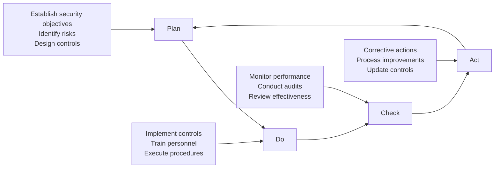

# Chapter 3: ISO 28000 Framework

## Introduction

ISO 28000 provides the international standard for security management systems in supply chains. Published by the International Organization for Standardization, it establishes requirements for assessing and managing security risks across the entire supply chain. This chapter examines the standard's structure, implementation methodology, and relationship to other management system standards.

## ISO 28000 Structure and Scope

ISO 28000:2007, revised in 2022, specifies requirements for a security management system applicable to organizations of all sizes involved in any aspect of the supply chain. The standard applies to manufacturing, service, storage, and transportation organizations at any production or supply stage.

### Core Principles

The standard is built on several fundamental principles:

1. **Risk-based approach**: Security measures proportional to assessed risks
2. **Process methodology**: Systematic, repeatable procedures
3. **Continual improvement**: Ongoing enhancement of security performance
4. **Management commitment**: Leadership engagement and resource allocation
5. **Competence and awareness**: Trained personnel understanding their security roles

!!! info "Standard Definition"
    ISO 28000 defines a security management system as "that part of the overall management system, based on a business risk approach, to establish and maintain security."

### Standard Components

The standard is organized into key sections:

| Section | Content | Purpose |
|---------|---------|---------|
| **Context of the Organization** | Understanding organizational and supply chain context | Define scope and boundaries |
| **Leadership** | Management commitment, policy, roles | Establish governance |
| **Planning** | Risk assessment, objectives, planning | Identify and prioritize security needs |
| **Support** | Resources, competence, communication, documentation | Enable implementation |
| **Operation** | Operational planning, security controls | Execute security measures |
| **Performance Evaluation** | Monitoring, measurement, audit, review | Assess effectiveness |
| **Improvement** | Nonconformity, corrective action, continual improvement | Drive enhancement |

## Security Management System Fundamentals

A security management system (SMS) provides systematic framework for managing supply chain security risks. Unlike ad-hoc security measures, an SMS integrates security into organizational processes and culture.

### Security Policy

The security policy articulates organizational commitment to supply chain security. It should:

- State the purpose and scope of security management
- Include commitment to meet legal and regulatory requirements
- Provide framework for setting security objectives
- Include commitment to continual improvement
- Be communicated throughout the organization and to relevant interested parties

!!! example "Sample Policy Statement"
    "XYZ Corporation commits to protecting the security and integrity of our supply chain through systematic risk management, compliance with international standards, and continual improvement of our security management system."

### Security Risk Assessment

ISO 28000 requires organizations to establish, implement, and maintain processes for assessing security risks. This includes:

**Identifying threats and vulnerabilities**
- Physical security threats (theft, tampering, terrorism)
- Cyber security threats (hacking, data breaches, ransomware)
- Operational threats (fraud, counterfeiting, unauthorized access)
- Natural and environmental threats

**Assessing likelihood and consequences**
- Probability of threat occurrence
- Potential impact on operations, reputation, compliance
- Velocity and cascading effects

**Determining risk acceptability**
- Risk appetite and tolerance levels
- Prioritization criteria
- Resource allocation decisions

**Identifying risk treatment options**
- Avoid, reduce, transfer, or accept risks
- Preventive vs detective vs corrective controls
- Cost-benefit analysis of treatment options

## PDCA Cycle Application

ISO 28000 adopts the Plan-Do-Check-Act (PDCA) cycle for continual improvement. This methodology enables systematic enhancement of security performance.

### Plan Phase

**Establish security objectives**: Define measurable targets aligned with organizational strategy and risk assessment outcomes.

**Examples:**
- Reduce security incidents by 25% within 12 months
- Achieve 100% supplier security certification within 24 months
- Implement access controls at all warehouses by Q3

**Develop security plan**: Document how objectives will be achieved, including:
- Specific security controls and procedures
- Resource requirements (budget, personnel, technology)
- Responsibilities and authorities
- Timeline and milestones
- Performance indicators

### Do Phase

**Implement security controls**: Deploy planned measures across operations:

- Physical security (access controls, surveillance, secure storage)
- Personnel security (background checks, training, awareness programs)
- Information security (encryption, access management, data protection)
- Transportation security (route planning, driver verification, tracking)
- Supplier security (qualification criteria, audits, contractual requirements)

**Ensure competence**: Train personnel on security procedures and their roles in the SMS.

**Maintain documentation**: Record evidence of implementation for audit and review.

### Check Phase

**Monitor and measure**: Track security performance against objectives:

- Incident frequency and severity
- Security audit findings
- Compliance with procedures
- Cost of security measures
- Effectiveness of controls

**Conduct internal audits**: Systematic examination of SMS implementation:
- Assess conformity with ISO 28000 requirements
- Evaluate effectiveness of security controls
- Identify nonconformities and improvement opportunities
- Verify documentation and records

**Management review**: Senior leadership periodically evaluates SMS:
- Overall security performance trends
- Audit results and corrective actions
- Changes in internal/external context
- Resource adequacy
- Improvement opportunities

### Act Phase

**Address nonconformities**: When security requirements are not met:
- Investigate root causes
- Implement corrective actions
- Verify effectiveness of corrections
- Update procedures to prevent recurrence

**Continual improvement**: Systematically enhance security performance:
- Implement lessons learned from incidents
- Adopt emerging security technologies
- Refine risk assessment methodologies
- Enhance training programs
- Update controls based on threat evolution

## ISO 28000 Certification Process

Organizations may seek third-party certification to demonstrate conformity with ISO 28000. Certification provides credibility with customers, regulators, and business partners.

### Certification Steps

**1. Gap Analysis**
- Compare current practices to ISO 28000 requirements
- Identify areas requiring development or enhancement
- Estimate resources and timeline for implementation

**2. SMS Development**
- Design security management system addressing all standard requirements
- Document policies, procedures, and work instructions
- Allocate resources and assign responsibilities

**3. Implementation**
- Deploy security controls across operations
- Train personnel on new procedures
- Generate records demonstrating conformity

**4. Internal Audit**
- Conduct comprehensive audit of SMS implementation
- Address identified nonconformities
- Verify readiness for certification audit

**5. Certification Audit (Stage 1)**
- Documentation review by certification body
- Assessment of SMS design and readiness
- Identification of any documentation gaps

**6. Certification Audit (Stage 2)**
- On-site assessment of SMS implementation
- Verification of effective operation
- Review of objective evidence

**7. Certification Decision**
- Certification body evaluates audit findings
- Issues certificate if conformity demonstrated
- Defines surveillance audit schedule

**8. Surveillance and Recertification**
- Annual surveillance audits maintain certification
- Full recertification every three years
- Continual conformity and improvement demonstrated

!!! tip "Certification Benefits"
    - Enhanced credibility with stakeholders
    - Competitive advantage in bid processes
    - Reduced insurance premiums
    - Improved security culture
    - Framework for continual improvement

## Relationship to Other ISO Standards

ISO 28000 integrates with other management system standards, enabling unified approaches.

### ISO 31000: Risk Management

ISO 31000 provides general risk management principles applicable across all organizational contexts. ISO 28000 applies these principles specifically to supply chain security.

**Integration points:**
- ISO 28000 security risk assessment aligns with ISO 31000 risk management process
- Both use similar risk evaluation criteria
- Organizations can maintain integrated risk registers covering all risk types

### ISO 9001: Quality Management

ISO 9001 establishes requirements for quality management systems. Both standards share similar structure and improvement methodology.

**Common elements:**
- PDCA cycle approach
- Process-based thinking
- Management responsibility
- Competence and training requirements
- Documentation and records
- Internal audit and management review
- Continual improvement

Organizations often integrate quality and security management, avoiding duplication while ensuring comprehensive coverage.

### ISO 45001: Occupational Health and Safety

ISO 45001 addresses worker health and safety. Supply chain security often intersects with safety considerations.

**Overlapping areas:**
- Incident investigation and corrective action
- Training and competence
- Emergency preparedness
- Contractor management
- Hazard identification (security threats as hazards)

### ISO 27001: Information Security

ISO 27001 focuses on information security management. Supply chain security increasingly involves digital systems and data protection.

**Complementary relationship:**
- ISO 28000 addresses broader supply chain security
- ISO 27001 provides detailed information security controls
- Organizations may reference ISO 27001 controls within ISO 28000 SMS
- Cyber threats require both standards' consideration

## Implementation Best Practices

Successful ISO 28000 implementation requires strategic approach and organizational commitment.

### Top Management Engagement

Leadership must actively champion the SMS:
- Allocate adequate resources
- Communicate importance to organization
- Participate in management reviews
- Make security-informed decisions
- Hold personnel accountable for security performance

### Risk-Based Resource Allocation

Focus resources on highest-priority risks:
- Use risk assessment to guide investment
- Implement cost-effective controls
- Avoid over-engineering low-risk areas
- Reassess priorities as threats evolve

### Cross-Functional Collaboration

Security management requires input from multiple disciplines:
- Procurement understands supplier risks
- Operations manages facility and process security
- IT addresses cyber threats
- Legal ensures regulatory compliance
- Finance evaluates cost-benefit trade-offs

### Security Culture Development

Embed security awareness throughout organization:
- Regular training and communication
- Recognition of security-conscious behaviors
- Clear reporting mechanisms for concerns
- Learning from incidents without blame
- Leadership modeling security commitment

### Integration with Existing Systems

Leverage existing management systems:
- Align security and quality audits
- Integrate documentation systems
- Coordinate training programs
- Combine management review meetings
- Unified corrective action processes

## Conclusion

ISO 28000 provides comprehensive framework for managing supply chain security risks. Its structured approach, based on the PDCA cycle, enables organizations to systematically assess threats, implement proportional controls, and continually improve security performance. Certification demonstrates commitment to international best practices and provides competitive advantages.

Integration with other ISO standards enables efficient, unified management systems. Successful implementation requires top management commitment, risk-based resource allocation, cross-functional collaboration, and security culture development.

The next chapter examines specific approaches to managing supplier-related risks, a critical component of supply chain security.

## Self-Assessment Questions

1. What are the seven main sections of the ISO 28000 standard?
2. How does the PDCA cycle support continual improvement?
3. What is the difference between Stage 1 and Stage 2 certification audits?
4. How do ISO 28000 and ISO 31000 relate to each other?
5. Why is top management engagement critical for SMS success?
