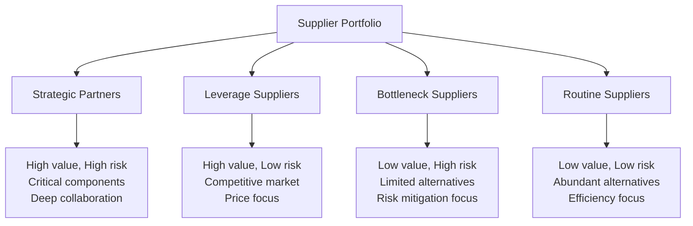
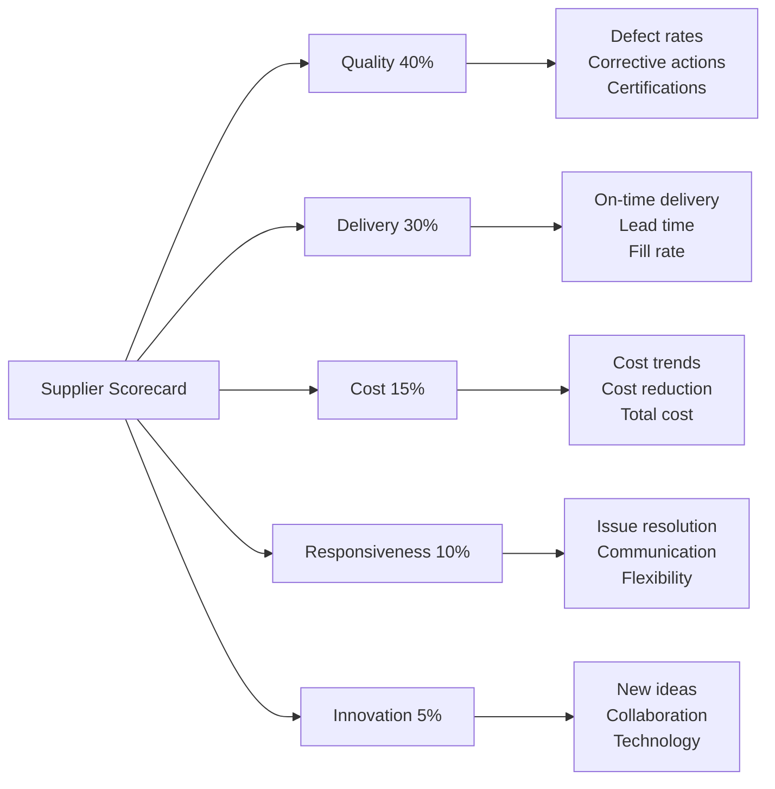

# Chapter 4: Supplier Risk Management

## Introduction

Suppliers represent both critical enablers and potential vulnerabilities in supply chains. A single supplier failure can cascade through the entire network, halting production and damaging customer relationships. This chapter examines systematic approaches to evaluating, monitoring, and mitigating supplier-related risks across single and multi-tier supply chains.

## The Supplier Risk Landscape

Modern organizations typically manage hundreds or thousands of supplier relationships. These relationships vary dramatically in strategic importance, complexity, and risk exposure.

### Supplier Categorization

Not all suppliers carry equal risk. Organizations should segment suppliers based on strategic significance and supply market characteristics:



**Strategic Partners**: High-value, difficult-to-replace suppliers requiring collaborative relationships and intensive risk management.

**Leverage Suppliers**: High-value commodities with multiple sources. Focus on competitive bidding and supplier rotation.

**Bottleneck Suppliers**: Limited alternatives create dependency despite lower spend. Require risk mitigation despite lower financial value.

**Routine Suppliers**: Abundant alternatives and low criticality. Standardized processes and minimal risk management.

This segmentation guides resource allocation, with strategic and bottleneck suppliers receiving disproportionate risk management attention.

## Supplier Evaluation Criteria

Comprehensive supplier evaluation examines multiple dimensions of capability and risk.

### Financial Health Assessment

Financial instability poses severe supply continuity risk. Supplier bankruptcy or cash flow crises can abruptly terminate supply relationships.

**Key Financial Indicators:**

| Metric | What It Measures | Warning Signs |
|--------|------------------|---------------|
| **Current Ratio** | Short-term liquidity | <1.5 suggests cash constraints |
| **Debt-to-Equity Ratio** | Financial leverage | >2.0 indicates high debt burden |
| **Days Sales Outstanding** | Collection efficiency | Increasing trend suggests cash flow issues |
| **Operating Margin** | Profitability | Declining margins indicate pricing pressure |
| **Z-Score** | Bankruptcy probability | <1.8 suggests financial distress |

!!! warning "Financial Red Flags"
    - Credit rating downgrades
    - Delayed payments to sub-suppliers
    - Reduced capital investments
    - Management turnover in finance roles
    - Auditor changes or qualified opinions
    - Negative cash flow from operations

**Data Sources:**
- Credit rating agencies (Dun & Bradstreet, Moody's, S&P)
- Financial statements (if publicly traded or provided)
- Trade credit reports
- Industry benchmarking data
- News and market intelligence

### Operational Capability

Operational assessment evaluates supplier's ability to meet quality, delivery, and volume requirements.

**Quality Performance:**
- Defect rates and trends
- Certification status (ISO 9001, industry-specific standards)
- Quality management system maturity
- Process control capabilities
- Root cause analysis and corrective action effectiveness

**Delivery Performance:**
- On-time delivery percentage
- Lead time consistency
- Order fill rates
- Responsiveness to changes
- Transportation and logistics capabilities

**Capacity and Flexibility:**
- Current capacity utilization
- Scalability for volume increases
- Ability to handle demand variability
- Production technology and equipment age
- Workforce skills and availability

### Strategic Alignment

Beyond operational metrics, strategic fit influences long-term relationship viability.

**Technology and Innovation:**
- R&D investments and capabilities
- Willingness to collaborate on new developments
- Technology roadmap alignment
- Intellectual property considerations

**Sustainability and Ethics:**
- Environmental management practices
- Labor standards and working conditions
- Anti-corruption policies
- Conflict minerals compliance
- Carbon footprint and climate commitments

**Cultural Compatibility:**
- Communication effectiveness
- Problem-solving approach
- Transparency and data sharing
- Long-term vs short-term orientation

## Financial Health Assessment Deep Dive

Given the criticality of supplier financial stability, organizations should implement structured financial monitoring.

### Altman Z-Score

The Altman Z-Score predicts bankruptcy probability using publicly available financial data:

**Z-Score Formula:**
```
Z = 1.2(Working Capital/Total Assets)
  + 1.4(Retained Earnings/Total Assets)
  + 3.3(EBIT/Total Assets)
  + 0.6(Market Value Equity/Total Liabilities)
  + 1.0(Sales/Total Assets)
```

**Interpretation:**
- Z > 2.99: Safe zone (low bankruptcy risk)
- 1.81 < Z < 2.99: Gray zone (moderate risk)
- Z < 1.81: Distress zone (high bankruptcy risk)

### Financial Monitoring Program

**Quarterly Reviews** for strategic suppliers:
- Updated financial statements analysis
- Credit report refresh
- Payment pattern monitoring
- News and market intelligence scan

**Annual Deep Dives**:
- Comprehensive financial analysis
- Site visits and management interviews
- Industry positioning assessment
- Five-year trend analysis

**Trigger-Based Reviews**:
- Immediate assessment upon:
  - Credit rating downgrade
  - Negative earnings announcement
  - Management changes
  - Merger/acquisition activity
  - Regulatory issues or litigation

!!! tip "Proactive Approach"
    Don't wait for supplier failure. Financial monitoring enables early intervention, alternative source development, or managed transitions before disruptions occur.

## Single-Source vs Multi-Source Strategies

The decision to rely on single or multiple suppliers for each component involves complex trade-offs.

### Single-Source Advantages

**Cost Efficiency:**
- Volume discounts through consolidated spend
- Lower transaction costs (fewer relationships to manage)
- Reduced inventory (less safety stock across sources)
- Simplified quality control and communication

**Strategic Partnership:**
- Deeper collaboration and trust
- Joint investment in specialized capabilities
- Intellectual property protection
- Co-development opportunities

**Quality Consistency:**
- Standardized processes and outputs
- Learning curve effects improve performance
- Simplified root cause analysis for issues

### Single-Source Risks

**Concentration Risk:**
- Total dependency creates vulnerability
- Supplier has negotiating leverage
- No redundancy if supplier fails
- Limited market benchmarking

**Disruption Amplification:**
- Any supplier issue becomes buyer's crisis
- No alternative capacity immediately available
- Long lead times to qualify new sources

### Multi-Source Advantages

**Risk Mitigation:**
- Redundant capacity buffers disruptions
- Competitive dynamics maintain performance
- Market intelligence through multiple relationships
- Faster response to supplier issues (shift volume)

**Supply Security:**
- Geographic diversification reduces regional risk
- Technology diversification (different process capabilities)
- Negotiating leverage through competition

### Multi-Source Challenges

**Complexity:**
- Higher transaction costs
- Multiple quality systems to monitor
- Coordination overhead
- Split volumes may reduce economies of scale

**Reduced Partnership:**
- Suppliers less willing to invest in relationship
- Limited collaboration on innovation
- Potential for opportunistic behavior

### Strategic Decision Framework

| Factor | Favors Single-Source | Favors Multi-Source |
|--------|---------------------|---------------------|
| **Component criticality** | Low (easily substituted) | High (production stoppage if unavailable) |
| **Supplier market** | Monopoly or oligopoly | Competitive with qualified alternatives |
| **Customization** | Highly specialized | Standardized or commodity |
| **Volume** | High (justify dedication) | Lower (insufficient for supplier commitment) |
| **Innovation importance** | High (collaboration critical) | Low (proven technology) |
| **Lead time** | Long (switching costly) | Short (rapid re-sourcing possible) |
| **Risk tolerance** | High | Low |

!!! example "Hybrid Approach"
    Many organizations adopt "primary + backup" strategies: one supplier handles 70-80% of volume with deep partnership, while qualified backup supplier maintains capability through 20-30% allocation. This balances partnership benefits with risk mitigation.

## Supplier Auditing

Audits provide objective assessment of supplier capabilities and risks beyond desktop analysis.

### Audit Types

**Document Audits:**
- Review quality system documentation
- Verify certifications and compliance
- Assess documented processes and procedures
- Can be conducted remotely

**Process Audits:**
- Observe actual production processes
- Verify adherence to documented procedures
- Assess process controls and problem-solving
- Identify improvement opportunities
- Require on-site presence

**System Audits:**
- Comprehensive evaluation of management systems
- Assess organizational capabilities across functions
- Review management commitment and culture
- Examine continual improvement mechanisms

**Surveillance Audits:**
- Periodic monitoring of approved suppliers
- Verify sustained compliance and performance
- Identify emerging issues
- Reinforce expectations

### Audit Frequency

| Supplier Category | Initial Audit | Surveillance Frequency |
|-------------------|---------------|------------------------|
| Strategic Partners | Comprehensive on-site | Annual or semi-annual |
| Bottleneck Suppliers | Process audit on-site | Annual |
| Leverage Suppliers | Document + selective process | Biennial or risk-triggered |
| Routine Suppliers | Document only | As needed |

### Audit Process

**Pre-Audit:**
- Define audit scope and objectives
- Assemble audit team with relevant expertise
- Review supplier documentation and performance data
- Prepare audit plan and checklists
- Communicate expectations to supplier

**On-Site Audit:**
- Opening meeting to confirm scope and schedule
- Document review and interviews
- Production floor observation
- Sample testing and verification
- Nonconformity documentation
- Closing meeting to present findings

**Post-Audit:**
- Issue formal audit report with findings
- Classify findings by severity (critical, major, minor, observation)
- Supplier develops corrective action plan
- Auditor verifies corrective actions
- Update supplier qualification status

!!! note "Audit Best Practices"
    - Trained auditors with relevant technical knowledge
    - Standardized audit protocols ensure consistency
    - Focus on process effectiveness, not just compliance
    - Look for evidence of continual improvement
    - Balance rigor with partnership mentality

## Contractual Risk Mitigation

Contracts establish legal framework for managing supplier risks.

### Key Contract Provisions

**Business Continuity Requirements:**
- Supplier must maintain documented business continuity plan
- Notification requirements for disruptions
- Minimum inventory buffers or dual-sourcing by supplier
- Regular testing of continuity plans

**Performance Standards:**
- Specific quality, delivery, and responsiveness metrics
- Measurement methodologies and reporting frequency
- Performance improvement trajectories for new suppliers

**Remedies and Recourse:**
- Service level agreements with financial penalties
- Termination rights for sustained nonperformance
- Liability caps and insurance requirements
- Indemnification for quality issues

**Security and Compliance:**
- Cybersecurity standards and audit rights
- Data protection and confidentiality
- Regulatory compliance requirements
- Right to audit facilities and sub-suppliers

**Change Management:**
- Notification requirements for facility, process, or material changes
- Change approval process
- Transition support for end-of-life products

**Intellectual Property:**
- Ownership of jointly developed IP
- Confidentiality and non-disclosure
- Restrictions on supplier working with competitors

**Exit Provisions:**
- Transition assistance requirements
- Documentation and tooling transfer
- Wind-down inventory management

!!! warning "Contract Limitations"
    Contracts provide recourse but don't prevent disruptions. Even with strong contractual protections, supplier failures cause operational impacts. Contracts complement, but don't replace, proactive risk management.

## Supplier Scorecards

Scorecards provide structured performance measurement and communication framework.

### Scorecard Components



Weightings should reflect strategic priorities and vary by supplier category.

### Scorecard Process

**Monthly Scoring:**
- Calculate metrics from operational data
- Assign ratings (e.g., 1-5 scale)
- Compute weighted overall score
- Identify trends and exceptions

**Quarterly Business Reviews:**
- Review scorecard with supplier
- Discuss improvement opportunities
- Align on action plans
- Recognize strong performance

**Annual Segmentation:**
- Classify suppliers by overall performance
- Preferred, approved, probationary, disqualified
- Determine audit frequency and sourcing strategy
- Inform contract renewal decisions

## Tier-2 and Tier-3 Visibility

Many disruptions originate beyond tier-1 suppliers. Visibility into deeper supply chain tiers enables proactive risk management.

### Building Multi-Tier Visibility

**Supplier Mapping:**
- Require tier-1 suppliers to disclose critical sub-suppliers
- Map component flows through tiers
- Identify concentration points and single points of failure
- Understand geographic distribution across tiers

**Sub-Supplier Assessment:**
- Extend auditing to critical tier-2 suppliers
- Require tier-1 suppliers to monitor tier-2 performance
- Flow-down requirements (quality, security, compliance)
- Direct relationships with strategic tier-2 suppliers

**Technology Enablement:**
- Supply chain mapping software
- Blockchain for multi-tier traceability
- Shared platforms for tier visibility
- Collaborative data sharing among supply chain partners

### Challenges and Solutions

**Challenge:** Suppliers reluctant to disclose sub-suppliers (competitive information)
**Solution:** Contractual requirements, third-party escrow of information, limited disclosure of critical sub-suppliers only

**Challenge:** Resource intensity of managing multiple tiers
**Solution:** Risk-based approach focusing on critical components, leverage tier-1 supplier capabilities

**Challenge:** Limited influence over tier-2/tier-3 suppliers
**Solution:** Work through tier-1 suppliers, provide incentives for transparency, develop direct relationships where strategic

## Conclusion

Supplier risk management requires systematic evaluation, continuous monitoring, and strategic sourcing decisions. Financial health assessment identifies stability risks. Operational evaluation ensures capability. Single vs multi-source strategies balance partnership and resilience. Auditing verifies capabilities objectively. Contracts establish expectations and recourse. Scorecards measure performance. Multi-tier visibility extends risk management beyond direct suppliers.

Effective supplier risk management is not one-time assessment but ongoing process, adapting to changing conditions and emerging threats. Organizations should tailor approaches to supplier criticality, focusing resources on strategic and bottleneck suppliers while maintaining appropriate oversight of all relationships.

The next chapter examines logistics and disruption management, addressing risks in physical movement and storage of materials.

## Self-Assessment Questions

1. How does supplier segmentation guide risk management resource allocation?
2. What does an Altman Z-Score below 1.81 indicate?
3. What are the key trade-offs between single-source and multi-source strategies?
4. How do process audits differ from document audits?
5. Why is tier-2 and tier-3 supplier visibility important?
