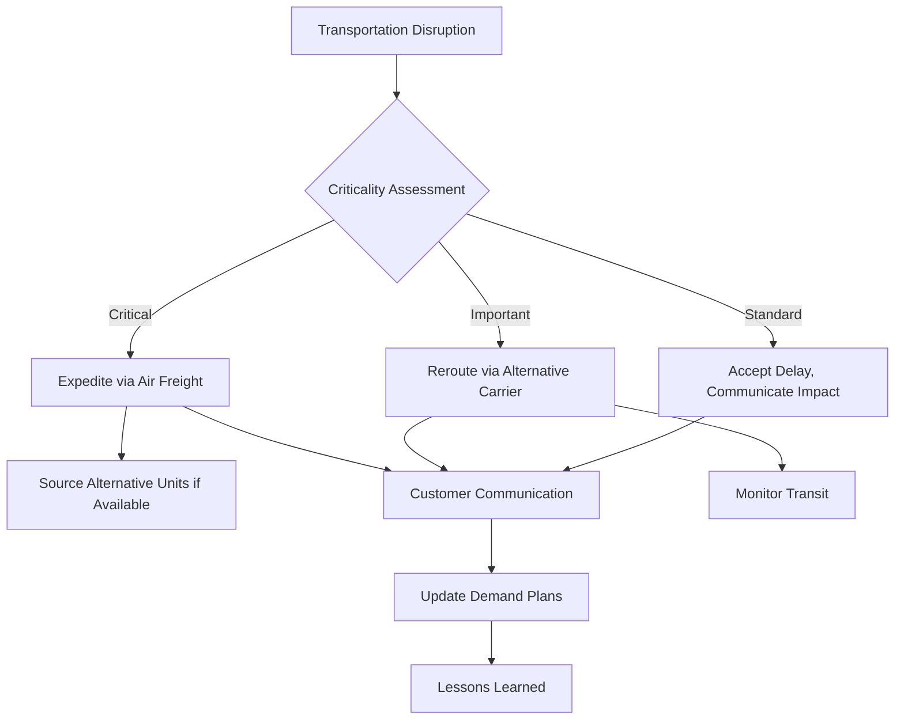
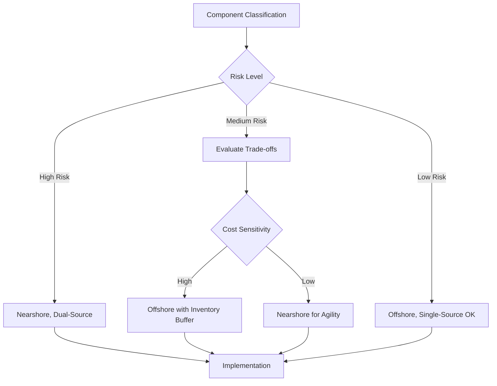

# Chapter 5: Logistics and Disruption Management

## Introduction

Logistics—the physical movement and storage of materials—represents a critical vulnerability in supply chains. Transportation disruptions, inventory shortages, port congestion, and natural disasters can instantly halt operations despite having reliable suppliers. This chapter examines strategies for managing logistics risks and building resilience through inventory, sourcing geography, and contingency planning.

## Transportation Risk

Global supply chains depend on complex transportation networks spanning ocean shipping, air freight, trucking, and rail. Each mode carries distinct risk profiles.

### Ocean Shipping Risks

Ocean freight handles approximately 80% of global trade volume. Container shipping faces unique vulnerabilities:

**Port Congestion:**
- Limited terminal capacity creates bottlenecks
- Labor disputes disrupt loading and unloading
- Chassis shortages delay container movement
- Customs clearance delays at destination ports

**Route Disruptions:**
- Weather (hurricanes, storms) forces route changes
- Geopolitical conflicts close critical chokepoints
- Piracy in specific regions (Horn of Africa, Malacca Strait)
- Canal blockages (Suez, Panama) affect global flows

**Carrier Reliability:**
- Schedule reliability varies by carrier and route
- Blank sailings (cancelled voyages) during demand downturns
- Equipment availability (containers, vessels)
- Financial stability of shipping lines

!!! example "Suez Canal Blockage Impact"
    When the Ever Given blocked the Suez Canal in March 2021, approximately 12% of global trade was affected. Over 400 vessels queued, with estimated economic impact of $9-10 billion per day. Organizations with alternative routes or inventory buffers experienced minimal disruption, while just-in-time systems faced severe shortages.

### Air Freight Risks

Air freight provides speed but at premium cost. Risks include:

**Capacity Constraints:**
- Belly cargo capacity (passenger flights) fluctuates with travel demand
- Dedicated freighters have limited availability
- Peak season competition (holidays, new product launches)
- Airport handling capacity during disruptions

**Cost Volatility:**
- Fuel price fluctuations directly impact rates
- Demand surges drive spot market prices
- Limited alternatives during disruptions create price spikes

**Geographic Limitations:**
- Not all destinations have adequate air service
- Weight and size restrictions
- Customs clearance capabilities vary by airport

### Ground Transportation

Trucking and rail transport face distinct challenges:

**Trucking Risks:**
- Driver shortages create capacity constraints
- Hours-of-service regulations limit flexibility
- Weather impacts (ice, snow, flooding) delay deliveries
- Traffic congestion in urban areas
- Fuel price volatility

**Rail Risks:**
- Track infrastructure condition and maintenance
- Equipment availability (railcars, locomotives)
- Scheduling and priority (freight vs passenger)
- Single-track sections create bottlenecks
- Intermodal transfer points as failure points

### Transportation Risk Mitigation

**Diversify Carriers and Routes:**
- Avoid single carrier dependency
- Identify alternative routing options
- Maintain relationships with multiple logistics providers
- Pre-negotiate capacity during peak periods

**Build Visibility:**
- Real-time tracking of shipments
- Proactive alerts for delays
- Carrier performance monitoring
- Transit time variability analysis

**Plan for Disruptions:**
- Identify critical chokepoints in routes
- Develop rerouting plans
- Maintain emergency air freight relationships
- Budget contingency for expedited shipping

## Inventory Buffering Strategies

Inventory serves as shock absorber against supply and demand variability. Strategic inventory positioning mitigates disruption risks.

### Inventory Types and Purposes

**Cycle Stock:**
- Normal inventory to meet expected demand
- Determined by ordering frequency and demand rate
- Minimal buffer against disruptions

**Safety Stock:**
- Buffer against demand and supply uncertainty
- Protects against stockouts during disruptions
- Sized based on variability and service level targets

**Strategic Stock:**
- Deliberate excess inventory for high-risk components
- Insurance against known vulnerabilities (single-source, long lead time, geopolitical risk)
- Cost justified by disruption avoidance value

**Pipeline Inventory:**
- In-transit inventory between nodes
- Longer lead times = more pipeline inventory
- Vulnerable to transportation disruptions

### Safety Stock Optimization

Safety stock balances holding costs against stockout risks. The classic formula:

**Safety Stock = Z × σ_LT × √(Lead Time)**

Where:
- Z = service level factor (e.g., 1.65 for 95% service level)
- σ_LT = standard deviation of demand during lead time
- Lead Time = replenishment lead time

!!! tip "Enhanced Safety Stock for Risk"
    Traditional safety stock formulas assume stable lead times. For high-risk items, consider:
    - Using 95th percentile lead time instead of average
    - Adding buffer for low-frequency, high-impact disruptions
    - Dynamic adjustment based on real-time risk indicators

### Inventory Positioning

**Centralized vs Decentralized:**

| Approach | Advantages | Disadvantages | Best For |
|----------|------------|---------------|----------|
| **Centralized** | Lower total inventory, Economies of scale, Easier management | Longer delivery times, Single point of failure, Higher transportation costs | Slow-moving items, Predictable demand |
| **Decentralized** | Faster response, Regional redundancy, Local customer service | Higher total inventory, Duplication, Complex management | Fast-moving items, Variable demand, Critical components |

**Strategic Positioning:**
- Position strategic inventory near consumption points for critical items
- Centralize slow-movers to reduce total inventory
- Place inventory after postponement points (customize locally)
- Use regional hubs to balance responsiveness and efficiency

### Just-in-Time vs Just-in-Case

The pandemic exposed limitations of pure just-in-time (JIT) strategies optimized for efficiency over resilience.

**Just-in-Time Philosophy:**
- Minimize inventory to reduce waste
- Frequent, small deliveries
- Close supplier partnerships
- Pull-based replenishment

**Benefits:**
- Lower carrying costs
- Reduced obsolescence risk
- Smaller facility requirements
- Quality issues surface immediately

**Vulnerabilities:**
- No buffer for disruptions
- Requires perfect reliability
- Amplifies small variations
- Long recovery from disruptions

**Just-in-Case Adaptation:**
- Strategic inventory for disruption-prone items
- Longer-term supplier commitments
- Dual-sourcing critical components
- Regional inventory buffers

!!! note "Balanced Approach"
    Most organizations are moving toward hybrid models: JIT for stable, low-risk items while maintaining just-in-case buffers for critical, high-risk components. The key is risk-based segmentation rather than one-size-fits-all policies.

## Dual-Sourcing Strategies

Dual-sourcing maintains qualified suppliers in different geographic regions, providing insurance against regional disruptions.

### Geographic Diversification Benefits

**Regional Risk Mitigation:**
- Natural disasters affect localized areas
- Geopolitical events are geography-specific
- Regulatory changes vary by country
- Labor issues and strikes are regional

**Transportation Flexibility:**
- Multiple origin points enable routing alternatives
- Reduces dependency on specific ports or lanes
- Shorter distances to some markets
- Time zone coverage for responsiveness

### Implementation Challenges

**Cost Implications:**
- Volume split reduces economies of scale
- Multiple qualification and audit efforts
- Coordination overhead
- Potential quality variation between sources

**Complexity Management:**
- Different specifications or standards by region
- Multiple contracts and relationships
- Communication across time zones and languages
- Potential IP protection concerns

### Dual-Source Configuration

**Active-Active:**
- Both suppliers continuously producing
- Volume split (e.g., 60/40 or 50/50)
- Both suppliers maintain full capability
- Immediate capacity to shift volume

**Active-Passive:**
- Primary supplier handles majority (80-90%)
- Backup supplier qualified and maintains capability through smaller allocation
- Can ramp up if primary fails
- Lower complexity than active-active

**Regional Allocation:**
- Supplier A serves Americas
- Supplier B serves Europe/Asia
- Natural volume split by market
- Built-in geographic diversification

## Nearshoring vs Offshoring

Sourcing geography involves trade-offs between cost, lead time, risk, and other factors.

### Offshoring Drivers

**Cost Advantages:**
- Lower labor rates in developing economies
- Economies of scale in manufacturing hubs
- Access to specialized capabilities
- Tax and regulatory incentives

**Market Access:**
- Local content requirements for sales in specific markets
- Currency considerations
- Proximity to customers in growth markets

### Offshoring Risks

**Extended Lead Times:**
- Weeks for ocean shipping vs days for regional
- Limited flexibility and responsiveness
- High pipeline inventory
- Difficult to react to demand changes

**Geographic Concentration:**
- Many organizations source from same regions (China, SE Asia)
- Regional disruptions affect multiple suppliers
- Limited alternatives within economic distance

**Geopolitical Exposure:**
- Trade policy changes (tariffs, sanctions)
- Political instability
- Currency fluctuations
- IP protection challenges

**Hidden Costs:**
- Transportation and logistics complexity
- Inventory carrying costs
- Quality issues and returns
- Communication and coordination overhead
- Travel for oversight and problem-solving

### Nearshoring Benefits

**Shorter Lead Times:**
- Days vs weeks for transportation
- Faster response to demand changes
- Lower pipeline inventory
- Easier to implement JIT

**Reduced Risk:**
- Lower geopolitical exposure
- Similar regulatory environments
- Geographic diversification from concentration zones
- Easier oversight and collaboration

**Total Cost Competitiveness:**
- Lower transportation costs
- Reduced inventory carrying costs
- Fewer quality issues
- Higher productivity may offset labor rate differences

### Nearshoring Challenges

**Higher Direct Costs:**
- Labor rates higher than offshore alternatives
- Smaller economies of scale
- Limited supplier base for some capabilities

**Capacity Constraints:**
- Nearshore manufacturing capacity less developed
- Competition for limited suppliers
- Need to invest in supplier development

### Strategic Sourcing Framework

Organizations should segment items based on:
- **Criticality**: Impact of shortage on operations
- **Lead time sensitivity**: Need for responsiveness
- **Cost sensitivity**: Margin impact of sourcing decisions
- **Risk exposure**: Geographic, geopolitical, supplier concentration

High-criticality, lead-time-sensitive items favor nearshoring with dual-sourcing. Low-criticality commodities can offshore for cost optimization.

## Port and Customs Risk

International shipments face risks at border crossings and port facilities.

### Port Congestion

**Causes:**
- Demand surges exceeding terminal capacity
- Labor shortages or disputes
- Equipment breakdowns (cranes, handling systems)
- Weather disruptions
- COVID-related protocols and delays

**Impacts:**
- Extended dwell times (days to weeks)
- Demurrage charges for delayed container pickup
- Cascading effects on inland transportation
- Inventory shortages for buyers

**Mitigation:**
- Monitor port congestion indicators
- Use alternative ports when possible
- Build lead time buffers for known congestion periods
- Maintain relationships with customs brokers and freight forwarders

### Customs Clearance

**Regulatory Compliance:**
- Tariff classification errors cause delays
- Documentation discrepancies
- Valuation disputes
- Country-of-origin verification
- Import licensing requirements

**Inspection and Holds:**
- Random inspections delay clearance
- Targeted inspections based on risk profiles
- Agricultural or safety inspections
- Counterfeit goods investigations

**Best Practices:**
- Accurate and complete documentation
- Advance filing (ISF 10+2 in US)
- Trusted trader programs (C-TPAT, AEO)
- Experienced customs brokers
- Pre-classification rulings for new products

## Natural Disaster Contingency

Natural disasters represent low-probability, high-impact risks requiring advance planning.

### Disaster Categories and Supply Chain Impacts

**Earthquakes:**
- Infrastructure damage (roads, ports, factories)
- Power outages
- Water system failures
- Examples: Japan 2011, Taiwan semiconductor risks

**Floods:**
- Transportation route closures
- Inventory damage
- Production facility inundation
- Examples: Thailand 2011, European floods

**Hurricanes/Typhoons:**
- Port closures and damage
- Transportation disruptions
- Power outages
- Examples: US Gulf Coast, Southeast Asia

**Wildfires:**
- Facility damage
- Air quality impacts on workers
- Transportation route closures
- Examples: California, Australia

**Pandemics:**
- Workforce availability
- Facility closures (government-mandated)
- Demand pattern shifts
- Global simultaneous impact
- Example: COVID-19

### Contingency Planning Elements

**Risk Assessment:**
- Map supplier and facility locations
- Overlay natural disaster risk zones (seismic, flood plains, hurricane paths)
- Identify concentration risks
- Assess infrastructure dependencies (power, water, transportation)

**Business Continuity Plans:**
- Alternative supplier qualification
- Inventory buffers for high-risk locations
- Alternative transportation routes
- Facility hardening and backup systems
- Communication protocols for emergencies

**Response Protocols:**
- Supplier contact and status assessment procedures
- Decision trees for activation of alternatives
- Inventory allocation prioritization during shortages
- Customer communication templates
- Post-event recovery support for suppliers

!!! example "Earthquake Preparedness: Semiconductor Supply"
    Taiwan produces >60% of global semiconductors and sits on active seismic faults. Earthquake disruption could halt global electronics production. Mitigation strategies include:

    - Qualifying alternative fabs in other regions (Korea, US, Europe)
    - Maintaining strategic inventory of critical chips
    - Diversifying designs to use chips from multiple sources
    - Monitoring seismic activity for early warning
    - Pre-negotiated allocation agreements with foundries

### Insurance and Financial Protection

While insurance doesn't prevent disruptions, it mitigates financial impact:

- **Business interruption insurance**: Covers lost revenue during disruptions
- **Contingent business interruption**: Covers impacts from supplier failures
- **Marine cargo insurance**: Protects in-transit inventory
- **Political risk insurance**: Covers geopolitical events (expropriation, war)

Organizations should understand policy coverage, exclusions, and claim processes before disruptions occur.

## Conclusion

Logistics and disruption management requires multi-layered strategies addressing transportation, inventory, sourcing geography, and contingency planning. Transportation risk mitigation involves carrier diversification and route alternatives. Inventory buffering balances cost against disruption protection. Dual-sourcing provides geographic redundancy. Nearshoring reduces lead time and geopolitical risk despite potential cost increases. Port and customs optimization ensures smoother international flows. Natural disaster contingency planning prepares for low-probability, high-impact events.

No single strategy eliminates all risk. Effective logistics risk management combines multiple approaches, tailored to specific item criticality and risk profiles. The key is moving from efficiency-optimized just-in-time systems toward resilience-balanced just-in-case strategies for critical components.

The next chapter examines technology solutions enabling supply chain visibility and proactive risk management.

## Self-Assessment Questions

1. What are the primary risks associated with ocean shipping?
2. How does safety stock differ from strategic stock?
3. What are the trade-offs between just-in-time and just-in-case inventory strategies?
4. Why might nearshoring be preferable to offshoring despite higher labor costs?
5. What elements should be included in a natural disaster contingency plan?
