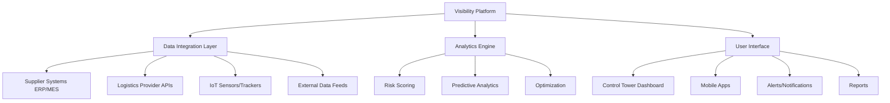
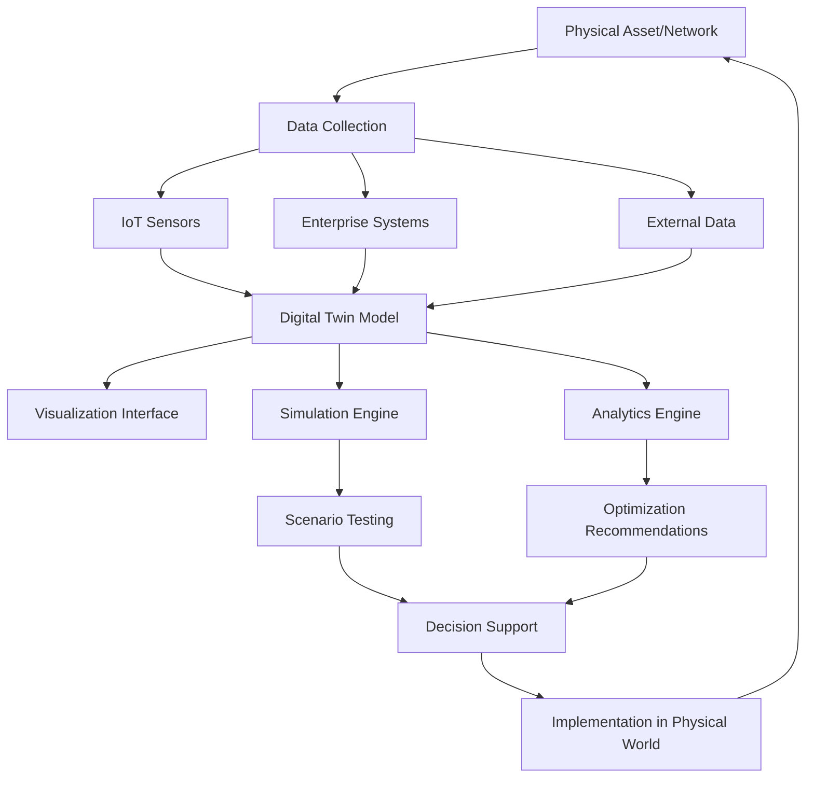
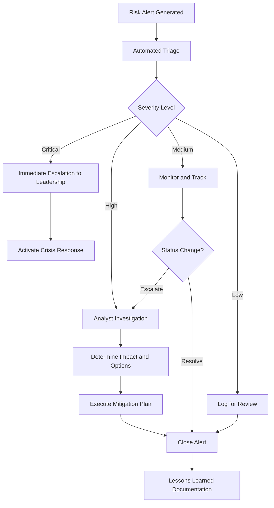

# Chapter 6: Technology and Visibility

## Introduction

Supply chain risk management increasingly depends on technology platforms that provide visibility, analytics, and predictive capabilities. Organizations that detect risks early and respond proactively outperform those relying on reactive firefighting. This chapter examines technologies enabling real-time visibility, predictive analytics, and intelligent decision-making across complex supply chain networks.

## The Visibility Imperative

Traditional supply chains operated with limited visibility. Organizations knew what they ordered and what arrived, but lacked insight into in-transit status, supplier operations, or deeper-tier networks. This opacity made proactive risk management impossible.

### Why Visibility Matters

**Early Warning:**
- Detect disruptions before they cascade
- Time to activate contingency plans
- Proactive customer communication

**Root Cause Analysis:**
- Understand where problems originate
- Distinguish symptoms from causes
- Target improvements effectively

**Performance Management:**
- Measure actual vs planned performance
- Hold partners accountable
- Drive continuous improvement

**Strategic Decision-Making:**
- Data-driven sourcing decisions
- Network optimization
- Scenario modeling and simulation

!!! info "Visibility Definition"
    **Supply chain visibility** is the ability to track and access data about products, materials, and information as they move through the supply chain, from raw material sourcing through delivery to end customers.

## Supply Chain Visibility Platforms

Visibility platforms aggregate data from multiple sources, providing unified views of supply chain operations.

### Platform Capabilities

**Multi-Tier Mapping:**
- Visual representation of supplier networks
- Identification of dependencies and concentration points
- Geographic distribution analysis
- Critical path identification

**Real-Time Tracking:**
- Location and status of shipments
- Production status at supplier facilities
- Inventory levels across network
- Predictive arrival times

**Exception Management:**
- Automated alerts for deviations
- Prioritization by business impact
- Escalation workflows
- Resolution tracking

**Analytics and Reporting:**
- Performance dashboards
- Trend analysis
- Predictive risk scoring
- Custom reports and visualizations

### Implementation Challenges

**Data Integration:**
- Suppliers use diverse systems (ERP, MES, WMS)
- Varying data formats and standards
- API availability and reliability
- Real-time vs batch data feeds

**Solution Approaches:**
- Standardized data exchange formats (EDI, XML, JSON)
- Platform-provided integration adapters
- Supplier portals for manual data entry
- Phased rollout starting with critical suppliers

**Data Quality:**
- Incomplete or inaccurate data from sources
- Timeliness issues (stale data)
- Inconsistent definitions across partners
- Missing data for some suppliers or tiers

**Solution Approaches:**
- Data validation rules and exception flagging
- Supplier training and change management
- Incentives for data quality (scorecards, contract terms)
- Machine learning to identify and correct anomalies

**Organizational Adoption:**
- Cultural resistance to transparency
- Workflow changes required
- Training needs across functions
- Defining roles and responsibilities

**Solution Approaches:**
- Executive sponsorship and communication
- Phased rollout with early wins
- User-friendly interfaces
- Clear value demonstration

## IoT Sensors and Tracking

Internet of Things (IoT) devices provide granular, real-time data about physical assets and environmental conditions.

### Tracking Technologies

**GPS Trackers:**
- Real-time location of shipments
- Geofencing (alerts when entering/leaving zones)
- Route optimization
- Theft prevention

**RFID Tags:**
- Automated identification and tracking
- Inventory accuracy
- Work-in-process visibility
- Authentication (anti-counterfeiting)

**Bluetooth Beacons:**
- Indoor location tracking
- Asset tracking within facilities
- Proximity detection
- Lower power consumption than GPS

**Environmental Sensors:**
- Temperature monitoring (cold chain integrity)
- Humidity, shock, tilt detection
- Light exposure (tamper detection)
- Condition-based quality assurance

### Use Cases

**Cold Chain Monitoring:**
Pharmaceutical and food supply chains require temperature control. IoT sensors provide:
- Continuous temperature logging
- Real-time alerts for excursions
- Automated compliance documentation
- Proof of proper handling for claims

**High-Value Asset Tracking:**
For expensive components or finished goods:
- Real-time location and security status
- Tamper detection
- Route adherence verification
- Recovery assistance if stolen

**Work-in-Process Visibility:**
Within manufacturing facilities:
- Track material location and status
- Identify bottlenecks and delays
- Automate inventory transactions
- Enable pull-based production

!!! example "IoT Success Story"
    A medical device manufacturer implemented IoT trackers on shipments to hospitals. When a shipment was delayed due to customs issues, the system automatically alerted both the logistics team and customer. The team rerouted an alternative shipment from regional inventory, preventing a surgical procedure delay. Without real-time visibility, the issue wouldn't have been detected until scheduled delivery time, leaving no time for corrective action.

## Blockchain for Traceability

Blockchain technology enables secure, tamper-proof records of supply chain transactions and provenance.

### Blockchain Fundamentals

**Key Characteristics:**
- **Distributed ledger**: No central authority; all participants maintain copies
- **Immutability**: Once recorded, transactions cannot be altered
- **Transparency**: Participants can verify transaction history
- **Smart contracts**: Automated execution based on predefined conditions

### Supply Chain Applications

**Provenance Tracking:**
- Record origin and journey of materials
- Verify authenticity and compliance
- Combat counterfeiting
- Support sustainability claims

**Example:** Diamond tracking from mine to retail, certifying conflict-free sourcing

**Multi-Party Coordination:**
- Shared visibility across supply chain partners
- Automated reconciliation of transactions
- Reduced disputes and paperwork
- Faster payments through smart contracts

**Example:** Shipping container tracking shared among shipper, carrier, port, customs, consignee

**Quality and Compliance:**
- Immutable quality records
- Automated compliance verification
- Simplified auditing
- Product recall precision

**Example:** Food safety tracking enables precise identification of contaminated batch source

### Limitations and Challenges

**Scalability:**
- Transaction processing speed limits
- Storage requirements for large networks
- Energy consumption (for proof-of-work systems)

**Adoption Barriers:**
- Requires participation from all network participants
- Integration with existing systems
- Standards still evolving
- ROI can be difficult to demonstrate

**Privacy Concerns:**
- Transparency vs confidential business information
- Permissioned vs public blockchain trade-offs
- Data security and access control

!!! note "Blockchain Reality Check"
    While blockchain offers compelling benefits for specific use cases (traceability, multi-party coordination), it is not a universal solution. Many supply chain challenges are better addressed through traditional databases, visibility platforms, or process improvements. Organizations should assess whether blockchain's unique properties (immutability, distributed consensus) are truly required for their specific problem.

## AI/ML for Demand Forecasting

Artificial intelligence and machine learning enable more accurate demand forecasts, reducing both stockouts and excess inventory.

### Traditional Forecasting Limitations

**Statistical Methods:**
- Time series analysis (moving averages, exponential smoothing)
- Based on historical patterns
- Assumes future resembles past
- Struggles with volatility and disruptions

**Manual Adjustments:**
- Planners override statistical forecasts
- Incorporates market intelligence
- Time-consuming and inconsistent
- Difficult to scale

### Machine Learning Advantages

**Pattern Recognition:**
- Identifies complex, nonlinear patterns
- Incorporates multiple variables simultaneously
- Adapts to changing conditions
- Learns from forecast errors

**Data Integration:**
- Combines internal data (sales, inventory, pricing)
- External data (weather, economic indicators, social media)
- Supplier data (capacity, lead times)
- Competitor information

**Continuous Learning:**
- Models improve with more data
- Automatic retraining as conditions change
- A/B testing of different algorithms
- Ensemble methods combining multiple approaches

### ML Techniques

| Technique | How It Works | Best For |
|-----------|--------------|----------|
| **Neural Networks** | Multi-layer pattern recognition | Complex, nonlinear relationships |
| **Random Forests** | Ensemble of decision trees | Robust to noise, interpretable |
| **Gradient Boosting** | Sequential error correction | High accuracy, many variables |
| **LSTM (Long Short-Term Memory)** | Specialized for time series | Capturing long-term dependencies |

### Implementation Considerations

**Data Requirements:**
- Sufficient historical data (typically 2+ years)
- Clean, consistent data
- Relevant external data sources
- Regular updates

**Model Management:**
- Version control and documentation
- Performance monitoring and retraining
- Explainability for stakeholder trust
- Fallback to traditional methods if models fail

**Organizational Integration:**
- Change management for planners
- Clear roles (human judgment + AI recommendations)
- Training on model interpretation
- Gradual rollout with proven accuracy

!!! tip "Hybrid Approach"
    Most successful implementations combine ML forecasts with human judgment. Models handle data-intensive pattern recognition while planners incorporate information that's difficult to quantify (new product launches, competitive moves, strategic initiatives). The key is clear roles and collaborative processes.

## Digital Twins

Digital twins are virtual replicas of physical supply chain assets, processes, or networks, enabling simulation and optimization.

### Digital Twin Capabilities

**Visualization:**
- 3D representation of facilities, equipment, networks
- Real-time status and condition
- Interactive exploration
- Training and onboarding

**Simulation:**
- Test scenarios without disrupting operations
- Evaluate "what if" alternatives
- Optimize configurations
- Validate changes before implementation

**Predictive Maintenance:**
- Model equipment degradation
- Predict failure before occurrence
- Optimize maintenance schedules
- Reduce downtime

**Network Optimization:**
- Simulate supply chain network configurations
- Evaluate facility locations and capacities
- Test sourcing strategies
- Assess resilience under disruption scenarios

### Creating Digital Twins

**1. Physical Asset Modeling:**
- CAD/BIM models for facilities
- Process flows and dependencies
- Network topology and relationships
- Constraints and capacities

**2. Data Integration:**
- Real-time operational data
- Historical performance data
- Environmental conditions
- Business rules and policies

**3. Simulation Logic:**
- Physics-based models (for equipment)
- Discrete event simulation (for processes)
- Agent-based modeling (for complex networks)
- Optimization algorithms

**4. Continuous Synchronization:**
- Automated data feeds keep twin current
- Validation against actual performance
- Model refinement based on variances
- Bidirectional updates (changes reflected in both)

### Use Cases

**Facility Design:**
- Simulate warehouse layouts before construction
- Optimize material flow and storage
- Test automation systems
- Validate capacity under demand scenarios

**Disruption Planning:**
- Simulate supplier failures
- Test inventory allocation strategies
- Evaluate transportation route alternatives
- Assess network resilience

**Continuous Improvement:**
- Identify bottlenecks and constraints
- Test process changes virtually
- Quantify improvement opportunities
- Validate before real-world implementation

## Control Towers

Supply chain control towers centralize monitoring, coordination, and decision-making across complex networks.

### Control Tower Functions

**Visibility and Monitoring:**
- Real-time dashboards showing network status
- KPI tracking across suppliers, logistics, inventory
- Exception highlighting and prioritization
- Drill-down capability from summary to detail

**Coordination:**
- Cross-functional collaboration (procurement, operations, logistics, sales)
- Partner communication and collaboration
- Issue resolution workflows
- Escalation management

**Analytics and Insights:**
- Performance trends and patterns
- Root cause analysis
- Predictive alerts
- Optimization recommendations

**Decision Support:**
- Scenario modeling
- Trade-off analysis
- Constraint-based recommendations
- What-if simulation

### Control Tower Architecture

**Physical vs Virtual:**

**Physical Control Towers:**
- Dedicated facility with large display screens
- Collocated team from multiple functions
- 24/7 monitoring and response
- High-visibility, command-center feel

**Virtual Control Towers:**
- Cloud-based platform accessible from anywhere
- Distributed team with collaboration tools
- Flexible staffing and coverage
- Lower infrastructure costs

Many organizations adopt hybrid models: virtual platforms with periodic physical command center sessions for major events or disruptions.

### Organizational Design

**Staffing:**
- Control tower manager/director
- Analysts monitoring specific regions or product lines
- Subject matter experts (logistics, procurement, demand planning)
- Technology support

**Governance:**
- Clear escalation paths and decision authorities
- Standard operating procedures for common issues
- Defined response protocols for disruptions
- Performance metrics and accountability

**Integration:**
- Connections to planning systems (demand, supply, production)
- Links to execution systems (ERP, WMS, TMS)
- Collaboration with business units and partners
- Regular business review processes

!!! example "Control Tower Impact"
    A consumer electronics company implemented a global control tower integrating supplier, logistics, and customer demand data. When a typhoon threatened a key supplier's region, the control tower detected the risk 48 hours before impact. The team immediately:

    - Contacted supplier to assess situation
    - Identified alternative inventory sources
    - Rerouted in-transit shipments away from affected ports
    - Communicated proactively with customers
    - Adjusted production schedules at assembly plants

    Result: Zero customer shipment delays despite supplier facility closure for 5 days. Without control tower visibility and coordination, the disruption would have caused weeks of backorders.

## Real-Time Risk Monitoring

Continuous risk monitoring enables proactive response before disruptions materialize.

### Risk Indicators

**Supplier Signals:**
- Financial health scores
- Delivery performance trends
- Quality metric changes
- Capacity utilization
- Employee sentiment (social media, reviews)

**Geographic/Environmental:**
- Weather forecasts and warnings
- Natural disaster alerts
- Political instability indices
- Labor unrest indicators
- Disease outbreak tracking

**Market Signals:**
- Commodity price volatility
- Demand pattern shifts
- Competitor actions
- Regulatory changes
- Technology disruptions

**Logistics Signals:**
- Port congestion levels
- Transportation capacity and rates
- Route disruptions
- Customs clearance times
- Carrier performance

### Risk Monitoring Platforms

Modern platforms aggregate diverse data sources:

**Internal Data:**
- Supplier performance metrics
- Inventory levels and locations
- Order and shipment status
- Quality and returns data

**External Data:**
- News feeds and social media
- Weather services
- Financial data providers
- Industry reports
- Government databases

**Analytics:**
- Anomaly detection identifies unusual patterns
- Natural language processing extracts insights from unstructured data
- Risk scoring quantifies and prioritizes threats
- Correlation analysis identifies hidden relationships

**Alerting:**
- Threshold-based alerts for metric deviations
- Predictive alerts for anticipated issues
- Prioritization by business impact
- Multi-channel notifications (email, SMS, platform)
- Escalation for unresolved alerts

### Response Workflows

## Conclusion

Technology enables the visibility, analytics, and decision support essential for modern supply chain risk management. Visibility platforms aggregate multi-tier data, providing early warning of disruptions. IoT sensors track assets and conditions in real-time. Blockchain ensures traceability and authenticity. AI/ML improves demand forecasting accuracy. Digital twins enable simulation and optimization. Control towers centralize monitoring and coordination. Risk monitoring platforms continuously scan for threats.

Successful technology implementation requires more than tool deployment. Organizations must address data integration, quality, and governance. Organizational change management ensures user adoption. Clear processes connect insights to decisions and actions. The goal is not technology for its own sake, but actionable intelligence that enables proactive risk management and resilient operations.

The final chapter examines how these capabilities combine to build organizational resilience and continuity in the face of inevitable disruptions.

## Self-Assessment Questions

1. What are the key capabilities of supply chain visibility platforms?
2. How do IoT sensors enable proactive risk management?
3. What supply chain problems are well-suited to blockchain solutions?
4. How does machine learning improve demand forecasting compared to traditional methods?
5. What are the core functions of a supply chain control tower?
