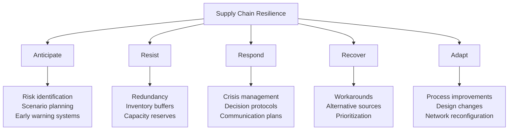
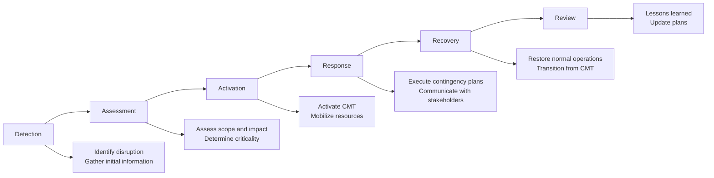

# Chapter 7: Resilience and Continuity

## Introduction

Despite best efforts at risk identification, assessment, and mitigation, disruptions will occur. The defining characteristic of resilient organizations is not avoiding all disruptions, but responding effectively and recovering rapidly when they happen. This chapter examines business continuity planning, resilience metrics, stress testing, crisis management, and emerging trends shaping the future of supply chain risk management.

## Understanding Supply Chain Resilience

Resilience represents the capacity to absorb disruptions, adapt to changing conditions, and return to desired performance levels rapidly.

### Resilience vs Efficiency

Traditional supply chain optimization focused on efficiency: lowest cost, minimal inventory, fastest throughput. Resilience often requires sacrificing some efficiency for robustness.

| Dimension | Efficiency Focus | Resilience Focus |
|-----------|------------------|------------------|
| **Inventory** | Minimize (reduce carrying costs) | Buffer stocks for critical items |
| **Suppliers** | Single-source (volume discounts) | Multi-source (redundancy) |
| **Geography** | Concentrate (economies of scale) | Diversify (reduce regional risk) |
| **Lead Time** | Longer acceptable (lower cost) | Shorter preferred (faster response) |
| **Capacity** | Run at high utilization | Maintain surge capacity |
| **Information** | Need-to-know basis | Broad visibility and sharing |

!!! note "The Resilience-Efficiency Frontier"
    Organizations face trade-offs between resilience and efficiency. The optimal balance depends on industry, competitive positioning, and risk appetite. Recent disruptions have shifted many organizations toward greater resilience, accepting efficiency costs as insurance premiums against future shocks.

### Components of Resilience

**Redundancy:**
- Backup suppliers, facilities, routes
- Excess inventory and capacity
- Parallel processes and systems
- Provides buffer against failures

**Flexibility:**
- Ability to change suppliers, routes, products quickly
- Cross-trained workforce
- Modular processes and equipment
- Enables adaptation to new conditions

**Visibility:**
- Early warning of emerging issues
- Understanding of dependencies and vulnerabilities
- Real-time status information
- Supports rapid response

**Collaboration:**
- Strong relationships with partners
- Information sharing and joint planning
- Aligned incentives
- Enables coordinated response

**Culture:**
- Risk awareness throughout organization
- Empowerment to escalate concerns
- Learning from incidents
- Continuous improvement mindset

## Business Continuity Planning

Business continuity planning (BCP) prepares organizations to maintain critical operations during disruptions.

### BCP Process

**1. Business Impact Analysis (BIA)**

Identify critical processes and assess disruption consequences:

- **Critical functions**: Which processes must continue?
- **Dependencies**: What resources, suppliers, systems are required?
- **Impact over time**: How do consequences escalate with duration?
- **Recovery priorities**: What sequence should restoration follow?

**Example BIA Output:**

| Function | Critical? | Max Tolerable Downtime | Revenue Impact/Day | Dependencies |
|----------|-----------|------------------------|--------------------|-----------------|
| Production Line A | Yes | 24 hours | $2M | Supplier X, Power, IT System |
| Warehouse Operations | Yes | 48 hours | $500K | Facility access, WMS, Staff |
| Invoicing | No | 1 week | $0 (can backlog) | Accounting system |

**2. Risk Assessment**

For each critical function, identify threats:
- Natural disasters affecting facilities or suppliers
- Supplier failures or capacity issues
- Transportation disruptions
- IT system outages
- Workforce unavailability

**3. Strategy Development**

Define how to maintain or rapidly restore critical functions:

**Preventive Controls:**
- Facility hardening (earthquake resistance, flood protection)
- Redundant suppliers and routes
- Data backups and system redundancy
- Safety stock and strategic inventory

**Response Capabilities:**
- Alternative suppliers identified and qualified
- Alternative production facilities arranged
- Emergency logistics providers contracted
- Manual workarounds documented

**4. Plan Documentation**

Create comprehensive, accessible continuity plans:

- Emergency contact information
- Decision-making authorities and escalation paths
- Step-by-step response procedures
- Alternative supplier and facility information
- Communication templates
- Resource inventories (equipment, inventory, key personnel)

**5. Testing and Maintenance**

Plans must be validated and kept current:

- Tabletop exercises walk through scenarios
- Simulation exercises test actual execution
- Supplier drills verify alternative sources work
- Annual plan reviews and updates
- Post-incident reviews capture lessons learned

!!! example "BCP in Action: Pandemic Response"
    A manufacturer's BCP identified workforce unavailability as a key risk. Pre-pandemic preparation included:

    - Cross-training workers on multiple production lines
    - Documented procedures for split-shift operations
    - Remote work capabilities for non-production roles
    - Alternative packaging suppliers qualified

    When COVID-19 hit, the company activated these plans immediately, maintaining 85% production capacity while competitors shut down completely. The investment in BCP paid for itself many times over through maintained revenue and market share gains.

## Supply Chain Resilience Metrics

Measurement enables management. Organizations should track resilience using quantitative metrics.

### Key Resilience Metrics

**Time to Recovery (TTR):**
- Time from disruption to restoration of normal operations
- Should measure actual recovery, not just workaround implementation
- Track by disruption type and severity
- Target: Continuous reduction

**Time to Survive (TTS):**
- How long can operations continue if inputs stop?
- Based on inventory levels, alternative sources, demand
- Critical metric for assessing buffer adequacy
- Target: Exceeds typical recovery time for key risks

**Recovery Time Objective (RTO):**
- Target time for function restoration
- Set based on business impact analysis
- Different RTOs for different functions
- Drives investment in resilience capabilities

**Recovery Point Objective (RPO):**
- Maximum acceptable data loss (for IT systems)
- Maximum acceptable production loss (for operations)
- Guides backup frequency and inventory buffers

**Supply Chain Disruption Index:**
- Aggregate measure of disruption frequency and severity
- Track over time to assess resilience improvement
- Benchmark against industry or competitors

**Supplier Risk Score:**
- Composite measure of supplier vulnerability
- Based on financial health, performance, geographic risk, single-source status
- Weighted by criticality to operations
- Guides risk mitigation priorities

**Network Diversity:**
- Number of qualified suppliers per component
- Geographic distribution of suppliers and facilities
- Concentration indices (e.g., Herfindahl index)
- Target: Reduced concentration over time

**Inventory Coverage:**
- Days of supply on hand
- Differentiated by component risk level
- Tracks buffer adequacy
- Balance against carrying cost

### Metric Implementation

**Define clearly:**
- Explicit calculation methodologies
- Data sources and owners
- Reporting frequency
- Target levels and acceptable ranges

**Track consistently:**
- Automated data collection where possible
- Regular review and reporting
- Trend analysis over time
- Root cause analysis for changes

**Act on insights:**
- Connect metrics to decision-making
- Investigate when targets not met
- Resource allocation based on metrics
- Recognition for improvement

!!! tip "Balanced Scorecard"
    Avoid over-focusing on single metrics. Use balanced scorecards capturing multiple dimensions: recovery speed, cost impact, customer service, employee safety, etc. Optimize for overall resilience, not individual metrics that might create perverse incentives.

## Stress Testing

Stress testing evaluates supply chain performance under extreme but plausible scenarios, revealing vulnerabilities and validating mitigation strategies.

### Stress Test Scenarios

**Natural Disasters:**
- Major earthquake in key sourcing region
- Hurricane affecting major port
- Flooding disrupting transportation corridors
- Wildfire threatening facilities

**Geopolitical Events:**
- Trade war imposing tariffs on key imports
- Sanctions restricting access to suppliers
- Border closures or import restrictions
- Political instability in sourcing countries

**Economic Shocks:**
- Recession reducing demand 30%
- Commodity price spike (2x increase)
- Currency devaluation affecting costs
- Credit market freeze limiting supplier financing

**Operational Failures:**
- Major supplier bankruptcy
- Quality crisis requiring product recall
- IT system outage (ransomware)
- Labor strike at key facility or port

**Pandemic/Health Crisis:**
- Workforce availability reduced 40%
- Facility closures mandated by government
- Demand pattern shifts
- Global logistics disruption

### Stress Testing Methodology

**1. Scenario Definition**
- Select scenario based on risk assessment
- Define parameters (severity, duration, scope)
- Ensure plausibility and relevance

**2. Impact Modeling**
- Use digital twin or simulation tools
- Trace effects through supply chain network
- Quantify operational and financial impacts
- Identify failure points and cascading effects

**3. Response Simulation**
- Test planned mitigation strategies
- Evaluate decision-making processes
- Assess communication and coordination
- Identify gaps in capabilities

**4. Analysis and Learning**
- Document findings and vulnerabilities
- Quantify residual risk after mitigation
- Prioritize improvements
- Update continuity plans

**5. Iteration**
- Re-test after implementing improvements
- Rotate through different scenarios
- Increase severity to find breaking points
- Regular schedule (annually for major scenarios)

!!! example "Stress Test Insight"
    An automotive manufacturer stress-tested a scenario where their single-source semiconductor supplier suffered a fire. The test revealed that despite having 60 days of inventory (typical lead time), recovery would take 90+ days due to allocation competition and qualification time for alternatives. This insight drove immediate qualification of a second supplier and increase of strategic inventory to 90 days for this critical component.

## Crisis Management

When disruptions occur, effective crisis management minimizes impact and accelerates recovery.

### Crisis Management Structure

**Crisis Management Team (CMT):**
- Senior leadership from key functions (Operations, Procurement, Finance, Legal, Communications)
- Clear decision-making authority
- Dedicated communication channels
- Rapid assembly capability (24-hour activation)

**Roles and Responsibilities:**

| Role | Responsibilities |
|------|------------------|
| **Crisis Manager** | Overall coordination, strategic decisions, external communication |
| **Operations Lead** | Production and facility status, workarounds, capacity allocation |
| **Supply Chain Lead** | Supplier status, alternative sources, logistics coordination |
| **Finance Lead** | Cost assessment, financial decisions, insurance claims |
| **Communications Lead** | Internal and external messaging, stakeholder management |
| **Legal/Compliance Lead** | Regulatory compliance, contractual issues, liability |

**Decision Protocols:**
- Pre-defined authority levels for different decision types
- Escalation thresholds and processes
- Documentation requirements
- Review and validation procedures

### Crisis Response Phases

**Detection and Assessment (0-4 hours):**
- Identify that disruption has occurred
- Gather initial information about scope and severity
- Assess potential business impact
- Determine if crisis activation warranted

**Activation (4-12 hours):**
- Assemble crisis management team
- Establish communication channels and command center
- Conduct detailed impact assessment
- Develop initial response strategy

**Response (Days-Weeks):**
- Execute contingency plans
- Implement workarounds and alternatives
- Communicate with customers, suppliers, employees, stakeholders
- Monitor situation and adjust response
- Coordinate across functions and partners

**Recovery (Weeks-Months):**
- Restore normal operations
- Transition from crisis mode to business-as-usual
- Address backlog and catch-up activities
- Monitor for secondary effects

**Review (Post-Recovery):**
- Conduct after-action review
- Document lessons learned
- Update risk assessments and continuity plans
- Implement improvements
- Recognize and reward response team

### Communication Management

Effective communication is critical during crises:

**Internal Communication:**
- Regular updates to employees
- Specific guidance for affected teams
- Channels for questions and concerns
- Recognition of extra efforts

**Customer Communication:**
- Proactive notification of impacts
- Transparent information about recovery timeline
- Alternative solutions or options
- Regular status updates until resolved

**Supplier Communication:**
- Coordinate on workarounds and alternatives
- Share information to enable mutual support
- Maintain relationships under stress
- Appreciation for extraordinary efforts

**External Stakeholders:**
- Investors: Financial impact and response
- Regulators: Compliance and safety assurance
- Media: Controlled messaging (if public interest)
- Community: Local impact and employment

!!! warning "Communication Pitfalls"
    - Over-promising recovery timelines (erodes trust when missed)
    - Lack of transparency (fuels speculation and anxiety)
    - Inconsistent messages across channels
    - Neglecting internal communication (employees are ambassadors)
    - Blame shifting rather than problem-solving

## Future Trends in Supply Chain Risk Management

Several emerging trends will shape supply chain risk management in coming years.

### Regionalization and Reshoring

COVID-19 exposed vulnerabilities of globally concentrated supply chains. Organizations are reconsidering geographic strategies:

**Drivers:**
- Geopolitical tensions (US-China trade, regional conflicts)
- Desire for shorter, more controllable supply chains
- Government incentives for local production
- Total cost reassessment (hidden costs of global sourcing)

**Implications:**
- Higher production costs but lower risk
- Need to develop regional supplier bases
- Investment in local manufacturing capabilities
- Trade-off analysis becomes more complex

### Circular Supply Chains

Sustainability pressures and resource constraints drive circular economy models:

**Characteristics:**
- Design for reuse, remanufacturing, recycling
- Reverse logistics for product returns
- Material recovery and recirculation
- Reduced virgin material dependency

**Risk Implications:**
- New dependencies (collection infrastructure, reprocessing capability)
- Quality variability in recycled materials
- Regulatory compliance complexity
- Need for traceability across product lifecycles

### Autonomous Supply Chains

AI, automation, and robotics enable self-managing supply chain capabilities:

**Technologies:**
- Autonomous vehicles for transportation
- Warehouse robots and automation
- AI-driven planning and optimization
- Smart contracts for automated execution

**Benefits:**
- Reduced human error
- 24/7 operations
- Rapid response to changes
- Lower labor dependency (addresses workforce risks)

**New Risks:**
- Cybersecurity vulnerabilities
- Technology failures and edge cases
- Workforce transition challenges
- Regulatory and liability questions

### Climate Change Adaptation

Climate change creates both chronic and acute supply chain risks:

**Physical Risks:**
- Increased frequency and severity of natural disasters
- Shifting agricultural zones
- Water scarcity affecting production
- Heat affecting worker productivity and equipment

**Transition Risks:**
- Carbon pricing and emissions regulations
- Investor and customer pressure for sustainability
- Stranded assets (fossil fuel infrastructure)
- Supply chain decarbonization requirements

**Adaptation Strategies:**
- Climate risk assessment in sourcing decisions
- Facility hardening and redundancy
- Sustainable sourcing requirements
- Transparent emissions tracking and reporting

## Conclusion

Supply chain resilience represents the culmination of risk identification, assessment, mitigation, and continuous improvement. Resilient organizations build redundancy, flexibility, visibility, and collaboration into their networks. Business continuity planning prepares for disruptions through analysis, strategy development, and testing. Metrics enable measurement and management of resilience. Stress testing reveals vulnerabilities before real crises. Crisis management structures and protocols enable effective response. Adaptive capacity allows organizations to learn and evolve.

The future of supply chain risk management will involve balancing efficiency with resilience, incorporating sustainability alongside traditional performance metrics, and leveraging technology for visibility and intelligence. Organizations that excel at supply chain risk management will transform disruptions from existential threats into competitive advantages, maintaining customer service and market position while competitors struggle.

ISO 28000 provides the framework, but true resilience comes from organizational commitment, cross-functional collaboration, continuous learning, and the courage to invest in capabilities that may not be used frequently but prove invaluable when needed.

## Self-Assessment Questions

1. What is the difference between supply chain efficiency and resilience?
2. What are the five key components of business continuity planning?
3. How does Time to Survive (TTS) differ from Time to Recovery (TTR)?
4. What are the six phases of crisis response?
5. How might climate change affect supply chain risk management strategies?
